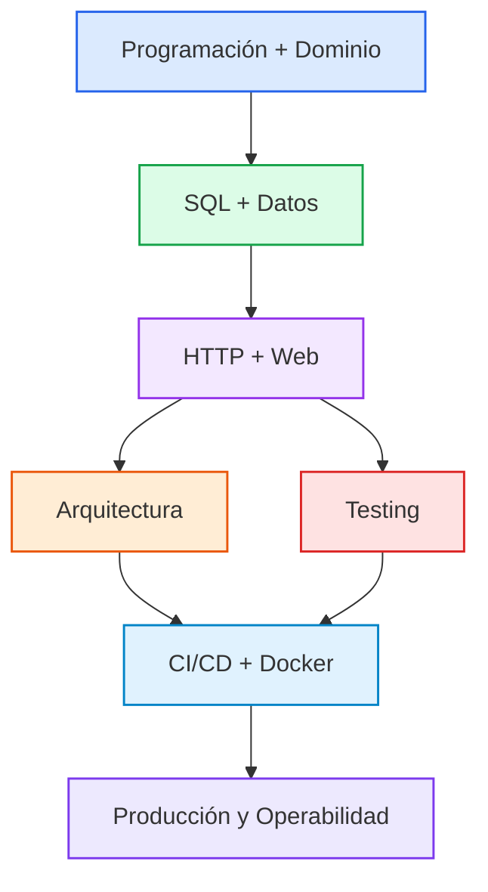

# Matriz de competencias

Esta matriz responde a una pregunta concreta:

> **¿Dónde se introduce, practica, consolida y demuestra cada competencia?**

La unidad de trazabilidad es la competencia individual `C01–C79`, definida en [`competencies.md`](competencies.md).

## 1. Convenciones

| Símbolo | Significado |
|---|---|
| **I** | Introducción: aparece y se comprende el concepto |
| **P** | Práctica: se aplica con guía o contexto conocido |
| **C** | Consolidación: se aplica con autonomía |
| **D** | Demostración: existe evidencia explícita para evaluación |
| **—** | No es foco del semestre |

Una competencia puede aparecer en varios semestres. La matriz identifica el rol pedagógico principal de cada aparición.

## 2. Matriz C01–C79

| ID | Competencia | S1 | S2 | S3 | S4 | S5 | S6 | Nivel final | Gate principal |
|---|---|---|---|---|---|---|---|---|---|
| C01 | Resolver problemas mediante programación | I/P | C | C | C | C | D | L4 | M-S6 |
| C02 | Escribir Python idiomático | I/P | C | P | P | — | D | L3 | M-S1 |
| C03 | Modelar dominios complejos | I/P | C | C | C | C | D | L4 | M-S6 |
| C04 | Diseñar software modular | I/P | C | C | D | C | D | L4 | M-S4 |
| C05 | Gestionar estados y errores | I/P | C | C | C | D | D | L3 | M-S5 |
| C06 | Debugging sistemático | I/P | C | C | C | D | D | L4 | M-S5 |
| C07 | Refactorizar código existente | P | C | C | D | C | D | L4 | M-S4 |
| C08 | Leer y modificar código ajeno | P | C | C | C | C | D | L4 | M-S6 |
| C09 | Git profesional | I/P | C | C | C | C | D | L4 | M-S6 |
| C10 | Branching / PRs / Issues | — | P | C | C | C | D | L3 | M-S3 |
| C11 | Code Review | — | P | C | C | C | D | L4 | M-S6 |
| C12 | Documentación técnica | P | C | C | C | C | D | L4 | M-S6 |
| C13 | Tests unitarios | I/P | C | C | C | C | D | L4 | M-S6 |
| C14 | Tests de integración | — | I/P | C | C | C | D | L3 | M-S2 |
| C15 | Tests de sistema | — | — | I/P | C | C | D | L3 | M-S3 |
| C16 | Diagnóstico de regresiones | P | C | C | D | C | D | L4 | M-S4 |
| C17 | Quality Gates | — | P | I/P | C | C | D | L3 | M-S6 |
| C18 | Modelado relacional | — | I/P | C | C | C | D | L4 | M-S2 |
| C19 | SQL | — | I/P | C | C | P | D | L4 | M-S2 |
| C20 | Optimización de consultas | — | P | C | C | D | D | L3 | M-S5 |
| C21 | PostgreSQL | — | I/P | C | C | C | D | L3 | M-S2 |
| C22 | Transacciones y ACID | — | I/P | C | C | D | D | L4 | M-S2 |
| C23 | Concurrencia | — | I/P | C | C | D | D | L4 | M-S4 |
| C24 | ORM consciente | — | P | C | C | C | D | L3 | M-S2 |
| C25 | Migraciones | — | I/P | C | C | C | D | L3 | M-S2 |
| C26 | Backup y Restore | — | P | C | C | D | D | L3 | M-S5 |
| C27 | Internet y Web | — | I | P | C | C | D | L2 | M-S3 |
| C28 | HTTP | — | I | P | C | C | D | L4 | M-S3 |
| C29 | Aplicaciones Web | — | P | I/P | C | C | D | L4 | M-S3 |
| C30 | APIs REST | — | I/P | C | C | C | D | L3 | M-S3 |
| C31 | Frontend práctico | — | — | I/P | C | P | D | L2 | M-S3 |
| C32 | Interacción dinámica | — | — | I/P | C | P | D | L3 | M-S3 |
| C33 | Identidad y sesiones | — | P | C | C | C | D | L3 | M-S3 |
| C34 | Autenticación | — | I/P | C | C | C | D | L3 | M-S3 |
| C35 | RBAC | — | P | C | C | C | D | L3 | M-S3 |
| C36 | Seguridad Web | — | P | I/P | C | D | D | L4 | M-S5 |
| C37 | Gestión de secretos | — | — | P | C | D | D | L3 | M-S5 |
| C38 | Dependencias seguras | — | — | P | C | D | D | L3 | M-S5 |
| C39 | DevSecOps básico | — | — | P | C | D | D | L2 | M-S5 |
| C40 | Arquitectura modular | P | C | C | D | C | D | L4 | M-S4 |
| C41 | Límites y dependencias | P | C | C | D | C | D | L4 | M-S4 |
| C42 | Evaluar trade-offs | P | C | C | D | C | D | L4 | M-S6 |
| C43 | ADRs | — | P | C | D | C | D | L3 | M-S4 |
| C44 | Evolución del sistema | — | P | C | D | C | D | L4 | M-S6 |
| C45 | Entornos reproducibles | — | P | C | D | C | D | L4 | M-S4 |
| C46 | Docker | — | — | I/P | C | C | D | L3 | M-S4 |
| C47 | CI | — | — | I/P | C | C | D | L3 | M-S4 |
| C48 | CD | — | — | I/P | C | C | D | L3 | M-S5 |
| C49 | Ambientes | — | P | C | C | C | D | L3 | M-S3 |
| C50 | Deployment | — | — | I/P | C | C | D | L3 | M-S5 |
| C51 | Linux | — | — | P | C | D | D | L3 | M-S5 |
| C52 | Redes aplicadas | — | — | P | C | D | D | L3 | M-S5 |
| C53 | Servicios | — | — | P | C | D | D | L3 | M-S5 |
| C54 | Asincronía | — | — | P | I/P | C | D | L3 | M-S4 |
| C55 | Workers | — | — | — | I/P | C | D | L3 | M-S4 |
| C56 | Caching | — | — | P | I/P | C | D | L3 | M-S4 |
| C57 | Performance | — | P | P | C | D | D | L3 | M-S5 |
| C58 | Diagnóstico | P | P | C | C | D | D | L4 | M-S5 |
| C59 | Logging | — | P | C | C | D | D | L4 | M-S5 |
| C60 | Métricas | — | — | P | C | D | D | L3 | M-S5 |
| C61 | Tracing | — | — | — | P | C | D | L2 | M-S6 |
| C62 | Observabilidad | — | — | P | C | D | D | L3 | M-S5 |
| C63 | SLI / SLO | — | — | — | P | C | D | L2 | M-S6 |
| C64 | Incidentes | — | — | — | P | C | D | L3 | M-S5 |
| C65 | Tolerancia a fallos | — | P | C | C | D | D | L3 | M-S5 |
| C66 | IA como tutor | I/P | P | — | — | — | D | L3 | M-S2 |
| C67 | IA como herramienta | — | P | C | C | C | D | L4 | M-S6 |
| C68 | Revisar código generado | — | P | C | C | D | D | L4 | M-S5 |
| C69 | Agentes | — | — | — | P | C | D | L3 | M-S6 |
| C70 | Spec Driven Development | — | — | — | P | C | D | L3 | M-S6 |
| C71 | Verificación humana | I/P | P | C | C | D | D | L4 | M-S5 |
| C72 | Código ajeno | P | C | C | C | C | D | L4 | M-S6 |
| C73 | Open Source | — | — | P | C | C | D | L3 | M-S6 |
| C74 | Comunicación técnica | P | C | C | C | C | D | L4 | M-S6 |
| C75 | Portfolio | — | — | — | P | C | D | L3 | M-S6 |
| C76 | Aprendizaje autónomo | I/P | C | C | C | C | D | L4 | M-S6 |
| C77 | Inglés técnico | I | P | C | C | C | D | L3 | M-S6 |
| C78 | Investigación y evaluación de alternativas técnicas | — | P | C | C | C | D | L4 | M-S6 |
| C79 | Liderazgo y comunicación técnica | — | — | P | C | C | D | L4 | M-S6 |

## 3. Grafo de Dependencias entre Áreas Técnicas

El currículo construye una progresión acumulativa donde cada área técnica se apoya en los fundamentos de las capas anteriores:

## 4. Qué significa "gate"

Un **gate** es el milestone en el que una competencia debe demostrarse de forma explícita. Que una competencia aparezca en un semestre no significa que ya esté dominada.

Ejemplo con `C23` (Concurrencia):
> `S2 (Introducción / Práctica)` → `S3/S4 (Consolidación)` → `M-S4 (Demostración y Gate)`

## 5. Fuentes de evidencia

La evidencia concreta se define en las clases, prácticas, project tasks y milestones. Los formatos habituales son:

- laboratorio;
- challenge;
- incremento del proyecto;
- Pull Request;
- code review;
- ADR;
- benchmark;
- diagnóstico o incidente;
- investigación técnica;
- defensa oral.

Cada artefacto educativo nuevo debe declarar qué competencias desarrolla. Cada evidencia de evaluación debe declarar qué competencias demuestra.

## 5. Regla de consistencia

`competencies.md` es la **fuente de verdad de los nombres, IDs y niveles finales**.

`study-plan.md` es la **fuente de verdad de la progresión temporal**.

`competency-matrix.md` es la **fuente de verdad de la trazabilidad entre competencia y semestre/gate**.

`assessment.md` es la **fuente de verdad de los criterios para determinar dominio y aprobar milestones**.

Si una modificación crea una discrepancia entre estos documentos, debe resolverse antes de incorporar nuevo material.
